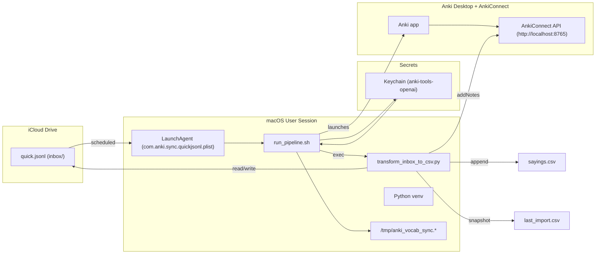

# 🇵🇹 Anki Portuguese Automation — Unified README
*Updated: 2025-10-23*

End-to-end workflow to capture and automate Portuguese vocabulary from iPhone, iPad, or MacBook into Anki using GPT and AnkiConnect.  
Enrich it to **C1-level European Portuguese**, and **load into Anki** via **AnkiConnect**.  
This README keeps your preferred unified structure and wording while aligning with the current codebase.

---

## 🧭 What this does (in 30 seconds)
- You **add** English or Portuguese words/short phrases from any device.
- They’re **appended** to a single **iCloud JSONL inbox**:
  ```
  /Users/koossimons/Library/Mobile Documents/com~apple~CloudDocs/Portuguese/Anki/inbox/quick.jsonl
  ```
- The transformer **normalizes, deduplicates, and enriches** items using GPT, producing **pt-PT** translations with **C1** example sentences (≈12–22 words).
- Notes are inserted into Anki (Deck **Portuguese (pt-PT)**, Model **GPT Vocabulary Automater**) via **AnkiConnect**.

> **Images:** the pipeline no longer fetches images. If you want visuals, add a **static image** to the Anki card template.

---

## 🧠 How It Works

1. You add English or Portuguese words on any Apple device (iPhone, iPad, MacBook).
2. These are saved into:
   ```
   ~/Library/CloudStorage/iCloud Drive/Portuguese/Anki/inbox/quick.jsonl
   ```
3. A macOS LaunchAgent runs a pipeline **automatically at 09:00 Lisbon time** each day.
4. The pipeline does the following:
   - Opens Anki (ensures AnkiConnect is available)
   - Runs `sanitize_quick_jsonl.py` to clean quotes and unicode
   - Calls GPT (OpenAI) using `transform_inbox_to_csv.py`
   - Generates the following:
     - `word_pt`, `word_en`, `sentence_pt`, `sentence_en`, `date_added`
   - Ensures no duplicates (checked against `sayings.csv`)
   - Adds new notes to Anki (deck: `Portuguese (pt-PT)`, model: `GPT Vocabulary Automater`)
   - Moves processed file to `.done` archive
   - Logs success or failure

---

## 🧱 Architecture



**Key design choices**
- Security first: API key stored only in macOS Keychain and injected at runtime; env overrides (`OPENAI_BASE_URL`, etc.) are cleared.
- Idempotent ingestion: The script normalizes and de-duplicates before generating or posting to Anki.
- Append-only master CSV: `sayings.csv` is the canonical export; `last_import.csv` makes the latest batch easy to review or re-import.
- Observable by default: Plain-text logs in `/tmp` simplify debugging; a manual kickstart exists for one-off runs.

---

## 📂 Data contract (JSONL inbox)
<<<<<<< HEAD

Each line in `quick.jsonl` is a **valid JSON object**. Accepted shapes:  
=======
Each line in `quick.jsonl` is a **valid JSON object**. Accepted shapes:
>>>>>>> 0d6e94dfd4c8ddc3a6e8961f1c4caa1b3ab73564
The transformer reads **one JSON object per line** from `inbox/quick.jsonl`.

**Required keys (choose one):**
- `entries` → either a **string** or a **list of strings**.  
  - When a **string**, it is **split** by the regex `[,
;]+` (commas, semicolons, or newlines).  
  - When a **list**, **each item** is split by the same regex.
<<<<<<< HEAD
- `word` → a single string (equivalent to a one-item `entries` line).

**Optional keys (ignored by the transformer but safe to include):**
- `ts` (timestamp), `src` (source), or any other metadata.

=======
- `word` → a single string (equivalent to a one‑item `entries` line).

**Optional keys (ignored by the transformer but safe to include):**
- `ts` (timestamp), `src` (source), or any other metadata.
>>>>>>> 0d6e94dfd4c8ddc3a6e8961f1c4caa1b3ab73564
### Examples (all valid)

```json
[
  {"ts":"2025-10-22 17:17:42","src":"quick","entries":"Suspected"},
  {"ts":"2025-10-22 22:23:35","src":"quick","entries":"Coding standards"},
  {"ts":"2025-10-22 22:23:42","src":"quick","entries":"Computer mouse"},
  {"ts":"2025-10-23 11:41:16","src":"quick","entries":"Euro bill"}
]
<<<<<<< HEAD
```

---

## 🧾 Anki Card Data Contract (Note Model & Field Order)

**Note type (model):** GPT Vocabulary Automater  
**Default deck:** Portuguese (pt-PT)  
**CSV source:** `sayings.csv` (UTF-8, comma-separated, quoted as needed)

**Field order (must match exactly)**
1. `word_en` – English headword/short phrase (1–3 tokens preferred)  
2. `word_pt` – European Portuguese translation (lemma/short phrase)  
3. `sentence_pt` – European Portuguese example sentence (C1, ~12–22 words)  
4. `sentence_en` – Natural English gloss for the sentence  
5. `date_added` – ISO date YYYY-MM-DD (local date of insertion)

The CSV columns are written in this exact order by the transformer and are inserted into Anki in the same order. If your note type uses a different field order, update the model to match or map fields accordingly before importing.

**Format & constraints**
- Encoding: UTF-8 only (the pipeline enforces UTF-8).  
- Punctuation/quotes: CSV is properly quoted; do not hand-edit quotes.  
- Length: keep `word_*` fields short; `sentence_pt` targets C1 length and style.  
- Duplicates: the pipeline de-duplicates against `sayings.csv` and within a batch.  
- In Anki, set the model’s duplicate check to the first field (`word_en`) and scope to “Deck” (recommended).  
- No media fields: images are handled statically in your Anki template (pipeline does not fetch images).  
- Audio: generated at review time with Anki TTS using `sentence_pt` (see template snippet below).

```csv
word_en,word_pt,sentence_pt,sentence_en,date_added
"computer mouse","rato","O rato sem fios ficou sem bateria durante a reunião de equipa.","The wireless mouse ran out of battery during the team meeting.","2025-10-23"
```

**Card template: pt-PT voice (TTS) on every Portuguese sentence**

Add this to your Back (or appropriate) template to ensure every card speaks the Portuguese sentence:

```html
<div>{{word_en}} → <b>{{word_pt}}</b></div>
<div>{{sentence_pt}}</div>

<!-- macOS/iOS pt-PT voice (Joana). Adjust voice/speed/pitch if desired. -->
{{tts pt_PT voices=Joana:sentence_pt}}
```

Why TTS: This uses the platform’s pt-PT voice (e.g., Joana on macOS/iOS) to generate audio on-the-fly, keeping the collection small and guaranteeing that every `sentence_pt` is spoken. If you prefer pre-rendered files instead, generate audio during packaging and add a media field—but this project defaults to TTS for simplicity and portability.

---

## ⚙️ Setup (once)

```bash
# Folders
mkdir -p ~/Library/Mobile\ Documents/com~apple~CloudDocs/Portuguese/Anki/{inbox,logs}

# Python env
python3 -m venv ~/anki-tools/.venv
~/anki-tools/.venv/bin/pip install --upgrade pip requests

# Store OpenAI API key in Keychain (service name is fixed)
security add-generic-password -a "$USER" -s "anki-tools-openai" -w "<YOUR_OPENAI_API_KEY>"

# Ensure Anki has the AnkiConnect add-on enabled
```

Default paths and env (overrides optional):
- `ANKI_BASE=~/Library/Mobile Documents/com~apple~CloudDocs/Portuguese/Anki`
- `LLM_MODEL=gpt-4o-mini`
- `ANKI_URL=http://127.0.0.1:8765`
- `MOCK_LLM=1` for offline tests (no API calls)

---

## 🚀 Run options

### A) One-liner (manual)

```bash
~/anki-tools/.venv/bin/python -u ~/anki-tools/transform_inbox_to_csv.py --deck "Portuguese (pt-PT)" --model "GPT Vocabulary Automater"
```

### B) Full pipeline runner (recommended)

```bash
bash ~/anki-tools/run_pipeline.sh
```

What it does:
- Logs start time, `whoami`, and `pwd` for scheduled run debugging  
- Pulls `OPENAI_API_KEY` from Keychain service **anki-tools-openai**  
- Clears stray OpenAI env vars  
- Opens Anki quietly and runs Python unbuffered

### C) Merge fragments first (optional)

```bash
python3 ~/anki-tools/merge_quick.py
```

---

## ⏰ Scheduling (launchd)

Run at 09:00, 13:00, and 19:00 local time. Create `~/Library/LaunchAgents/com.anki.tools.autorun.plist`:

```xml
<?xml version="1.0" encoding="UTF-8"?>
<!DOCTYPE plist PUBLIC "-//Apple//DTD PLIST 1.0//EN" "http://www.apple.com/DTDs/PropertyList-1.0.dtd">
<plist version="1.0"><dict>
  <key>Label</key><string>com.anki.tools.autorun</string>
  <key>ProgramArguments</key>
  <array><string>/bin/bash</string><string>-lc</string><string>~/anki-tools/run_pipeline.sh</string></array>
  <key>StartCalendarInterval</key>
  <array>
    <dict><key>Hour</key><integer>9</integer><key>Minute</key><integer>0</integer></dict>
    <dict><key>Hour</key><integer>13</integer><key>Minute</key><integer>0</integer></dict>
    <dict><key>Hour</key><integer>19</integer><key>Minute</key><integer>0</integer></dict>
  </array>
  <key>RunAtLoad</key><true/>
  <key>KeepAlive</key><false/>
  <key>StandardOutPath</key><string>/tmp/anki_vocab_sync.log</string>
  <key>StandardErrorPath</key><string>/tmp/anki_vocab_sync.err</string>
</dict></plist>
```

Load it:

```bash
launchctl unload ~/Library/LaunchAgents/com.anki.tools.autorun.plist 2>/dev/null || true
launchctl load  ~/Library/LaunchAgents/com.anki.tools.autorun.plist
```

---

## Monitoring OpenAI API Usage

You can verify and monitor cost and token activity for this pipeline in the **OpenAI Usage Dashboard**:

- Activity view: https://platform.openai.com/usage/activity  
- Billing overview: https://platform.openai.com/settings/organization/billing/overview

1. Use the **date range** and **project** filters to drill into the exact period and project used by this automation.  
2. Click into **API capabilities** (e.g., “Responses”) to see **per-model** breakdowns and minute-level TPM when needed.  
3. Remember: all usage timestamps are shown in **UTC** in the dashboard.

> If your org still uses the legacy view, use `https://platform.openai.com/usage/legacy` (or `.../account/usage`) and switch between **Cost** and **Activity**. The legacy dashboard will be removed eventually.

**Optional exports**
- Use the Export button in the usage dashboard to download CSVs for longer-range analysis.

---

## 🔍 Verification & logs

```bash
python3 ~/anki-tools/check_anki_adds_today.py
tail -n 100 /tmp/anki_vocab_sync.log
tail -n 100 /tmp/anki_vocab_sync.err
```

- OpenAI usage: https://platform.openai.com/usage  
- Monthly token log: `{ANKI_BASE}/logs/tokens_YYYY-MM.csv`

---

## C1 Sentence Generation (pt-PT)

The transformer enforces **advanced European Portuguese** output for examples:

- **Register & locale:** idiomatic **pt-PT** (European Portuguese).
- **Level:** **C1** complexity, native-like collocations.
- **Length:** **12–22 words** for `sentence_pt` (concise but rich).
- **Fields returned by the model (JSON only):** `word_en`, `word_pt`, `sentence_pt`, `sentence_en` (plain ASCII quotes, no code fences).
- **English gloss:** `sentence_en` is a natural translation, not literal word-by-word.

**Posting to Anki**
- Deck: **Portuguese (pt-PT)**
- Model: **GPT Vocabulary Automater**
- Tags: `auto`, `pt-PT`, plus a run-specific tag
- Duplicates: `allowDuplicate = false`, `duplicateScope = deck` (duplicates are **skipped**, logged, and not re-added)

**Input hygiene & skips**
- Normalizes whitespace/case, trims trailing punctuation.
- Heuristics avoid obviously long sentences that already end with terminal punctuation to keep generation focused on words/phrases.
- If the entry matches an existing note (by deck lookup), it is treated as a duplicate.

---

## 🧪 Offline test mode

Run without billing the API:

```bash
MOCK_LLM=1 ~/anki-tools/.venv/bin/python -u ~/anki-tools/transform_inbox_to_csv.py --limit 3
```

---

## 🧯 Troubleshooting

- **Key missing** → ensure Keychain item `anki-tools-openai` exists.  
- **AnkiConnect refused** → Anki must be running; add-on enabled.  
- **“All candidate notes already exist”** → nothing new after de-duplication.  
- **Encoding** → editor must be UTF-8; pipeline enforces UTF-8 on stdout/stderr.

---

## 📝 License

Private, personal automation. Adapt with care.

---

## 🗒️ Changelog (recent)

- **2025-10-23** — Docs: aligned to the **Unified** layout you prefer; **removed dynamic image fetching** from the pipeline and clarified that visuals should be handled **statically in the Anki template**. Kept GitHub-friendly formatting and added an ASCII architecture diagram.
=======
--
#### 🧾 Anki Card Data Contract (Note Model & Field Order)

>>>>>>> 0d6e94dfd4c8ddc3a6e8961f1c4caa1b3ab73564
