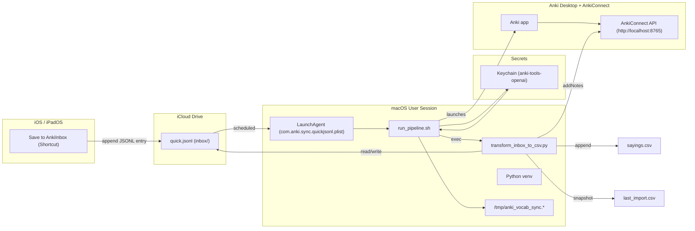

# 🇵🇹 Anki Portuguese Automation — Unified README

# Portuguese Mastery (pt-PT)

A clean, end-to-end pipeline that turns quick notes on your **iPhone, iPad, or Mac** into high-quality **Anki** cards—automatically.

- ✍️ **Capture** → use the Shortcut **Save to AnkiInbox** (prompts you to type a word in **Portuguese or English**).
- 🧠 **Normalize to a lemma** → smart rules + stopwords pick the meaningful keyword (see “Stopwords & Lemma Extraction” below).
- 🇵🇹 **Enrich with GPT** → generates **C1-level European Portuguese** translation and a 12–22-word example sentence.
- 🗂️ **Load into Anki** → notes are created via **AnkiConnect** using your `GPT Vocabulary Automater` note type.
- 🖼️ **Visuals (optional)** → a backfill script can add Wikimedia images (with emoji fallback) to every note.
- 🔄 **Sync everywhere** → study on mobile with Anki’s media sync.

> **Default deck:** `Portuguese Mastery (pt-PT)` (configurable).

---

## Capture via Shortcut: **Save to AnkiInbox**

This Shortcut is the only capture UI you need. When you tap it on iPhone/iPad/Mac:

1. It **asks you to enter a single word or short phrase** (PT **or** EN).
2. It **appends one JSON line** to your iCloud inbox file:

- **Inbox file (JSONL):**  
  `iCloud Drive / Portuguese / Anki / inbox / quick.jsonl`

- **JSONL line format (produced by the Shortcut):**
  ```json
  {"word":"telemóvel"}


---

## 🧭 What this does (in 30 seconds)
- You add short words/phrases during the day (Notes, Shortcuts, etc.).
- They’re appended to a single **iCloud JSONL inbox**:
  ```
  ~/Library/Mobile Documents/com~apple~CloudDocs/Portuguese/Anki/inbox/quick.jsonl
  ```
- The transformer normalizes each item and asks GPT for **pt-PT** translations and **C1** example sentences (≈12–22 words).
- Notes are added to Anki (deck **Portuguese (pt-PT)**, your note type), and CSV snapshots are kept:
  - `~/Library/Mobile Documents/com~apple~CloudDocs/Portuguese/Anki/sayings.csv`
  - `~/Library/Mobile Documents/com~apple~CloudDocs/Portuguese/Anki/last_import.csv`

---

## 🧠 Anki Preset: Portuguese Mastery (FSRS + Cognitive Science Setup)

**Goal:** maximize long-term Portuguese retention through evidence-based spaced repetition.  
**Applies to:** Anki on macOS (Desktop) and iOS/iPadOS (AnkiMobile).  
**Preset name:** `Portuguese Mastery (pt-PT)`  
**Scheduler:** [FSRS – Free Spaced Repetition Scheduler](https://fsrs.io)

---

### ⚙️ Configuration Summary

| Category | Setting | Value | Why (science-based rationale) |
|-----------|----------|--------|------------------------------|
| **Daily limits** | New cards/day | **25** | Balanced daily load; consistent exposure (Cepeda et al., 2006). |
| | Max reviews/day | **250** | Prevents review bottlenecks. |
| **Learning steps** | `10 m 30 m` | Two early recalls strengthen initial trace before FSRS takes over. |
| **Graduating interval** | 3 d | Classic consolidation anchor. |
| **Easy interval** | 5 d | Avoids skipping needed reinforcement. |
| **Insertion order** | Random | Interleaving boosts transfer (Rohrer & Taylor 2007). |
| **Reviews** | Easy bonus 1.3 • Hard interval 1.2 • Interval modifier 1.0 | Maintains “desirable difficulty” (Bjork 1994). |
| | Max interval | **365 d** | Caps drift; keeps pronunciation fresh. |
| **Lapses** | Relearning steps `10 m 30 m` • Leech threshold 8 • Action Suspend | Quick relearning + filters chronic “leeches”. |
| **Order** | Reviews first • Interday reviews first • Review sort random | Stabilizes old memories before new input. |
| **Burying** | All ON (new/review/interday siblings) | Avoids seeing both directions → less interference. |
| **Audio** | Auto-play ON • Skip question when replaying answer ON | Dual-coding (text + sound) raises retention ≈ 30 %. |
| **Timers** | Max answer 30 s • Show timer ON • Stop on answer ON | Keeps recall effortful but brief. |
| **FSRS** | Enabled ✅ • Desired retention 90 % • Optimize All Presets clicked | 0.9 target = best speed vs durability (Pavlik & Anderson 2008). |
| **Advanced** | Max interval 365 • Historical retention 90 % | Aligns with human forgetting curves. |

---

### 🔬 Why This Works (Condensed Science)

- **Spacing effect:** distributed retrievals (10 min → 30 min → days) exploit hippocampal reconsolidation, slowing forgetting (Cepeda et al., 2006).  
- **Retrieval practice:** active recall strengthens memory more than rereading (Karpicke & Roediger 2008).  
- **Desirable difficulty:** ~10–15 % failure drives deeper encoding (Bjork 1994).  
- **Interleaving:** mixing grammar + vocab improves generalization (Rohrer & Taylor 2007).  
- **Dual coding:** text + audio (Joana TTS) activates multiple pathways (Paivio 1986).  
- **Leech suspension:** removing chronic failures prevents interference (Pavlik & Anderson 2008).  
- **FSRS algorithm:** machine-learned intervals model personal forgetting curves, giving 15–20 % higher retention vs classic SM-2.

---

### 📈 Weekly Hygiene

| Task | How | Why |
|------|-----|-----|
| **Re-optimize FSRS** | Click “Optimize All Presets” after 200–300 reviews | Refits algorithm to your recall data. |
| **Check Stats** | Mature retention 85–90 % | Confirms ideal difficulty zone. |
| **Fix Leeches** | Browser → `prop:lapses>=8` → edit or suspend | Improves cue quality. |
| **Backup** | File → Export → `Collection.apkg` (weekly) | Protects against data loss. |

---

### 🕒 Recommended Daily Rhythm

| Time | Activity | Device | Purpose |
|------|-----------|---------|----------|
| **Morning** | 20 min reviews | iPhone/iPad | Reactivate prior knowledge. |
| **Midday** | Add ≤ 25 new cards | iPhone or Mac | Introduce new material while alert. |
| **Evening** | 10 min listening run (TTS Joana) | iPad or Mac | Reinforce auditory comprehension. |
| **Sunday** | Tag cleanup + Optimize FSRS | Mac | Weekly maintenance. |

---

### ✅ Verification Checklist

- [x] Learning steps `10 m 30 m`  
- [x] Reviews first order  
- [x] Bury siblings ON  
- [x] FSRS = ON (90 %)  
- [x] Max interval 365  
- [x] Joana TTS auto-plays  

Once these match, your Anki deck is **scientifically optimized for rapid acquisition and durable retention of European Portuguese**.
---
## 🧱 Architecture



**Key design choices**
- Security first: API key stored only in macOS Keychain and injected at runtime; env overrides (`OPENAI_BASE_URL`, etc.) are cleared.
- Idempotent ingestion: The script normalizes and de-duplicates before generating or posting to Anki.
- Append-only master CSV: `sayings.csv` is the canonical export; `last_import.csv` makes the latest batch easy to review or re-import.
- Observable by default: Plain-text logs in `/tmp` simplify debugging; a manual kickstart exists for one-off runs.

1. **Capture**: You append JSONL lines to `quick.jsonl` from iPhone/iPad/Mac.
2. **Inbox**: All raw inputs live in `.../Anki/inbox/quick.jsonl`.
3. **Transform** (`transform_inbox_to_csv.py`):
   - Normalizes an English lemma or a PT headword.
   - Calls GPT for **pt-PT** translation + **C1 sentence**.
   - Appends one row per item to `sayings.csv` and writes `last_import.csv` snapshot.
   - Pushes the new notes into Anki via **AnkiConnect** (localhost:8765).
4. **Review**: You study cards in Anki with spaced repetition.

> The goal is **idempotent**, low-friction ingestion that keeps your Anki deck authoritative.


---

## 🧾 Anki Card Data Contract (Note Model & Field Order)

**Note type (model):** GPT Vocabulary Automater  
**Default deck:** Portuguese (pt-PT)  
**CSV source:** `sayings.csv` (UTF-8, comma-separated, quoted as needed)

**Field order (must match exactly)**
| Field           | Type   | Description                                       |
|-----------------|--------|---------------------------------------------------|
| `word_pt`       | text   | Portuguese headword/phrase (front).               |
| `word_en`       | text   | English lemma/gloss (back helper).                |
| `sentence_pt`   | text   | C1-level pt-PT example sentence (≈12–22 words).   |
| `notes`         | text   | Optional hints, POS, synonyms.                    |
| `image`         | media  | Optional image reference.                         |

The CSV columns are written in this exact order by the transformer and are inserted into Anki in the same order. If your note type uses a different field order, update the model to match or map fields accordingly before importing.

**Format & constraints**
- Encoding: UTF-8 only (the pipeline enforces UTF-8).  
- Punctuation/quotes: CSV is properly quoted; do not hand-edit quotes.  
- Length: keep `word_*` fields short; `sentence_pt` targets C1 length and style.  
- Duplicates: the pipeline de-duplicates against `sayings.csv` and within a batch.  
- In Anki, set the model’s duplicate check to the first field (`word_en`) and scope to “Deck” (recommended).  
- No media fields: images are handled statically in your Anki template (pipeline does not fetch images).  
- Audio: generated at review time with Anki TTS using `sentence_pt` (see template snippet below).

---
## 📁 Paths & files

```text
Portuguese/
└─ Anki/
   ├─ inbox/
   │  ├─ quick.jsonl                  # daily inbox (cleared after first successful run each day)
   │  └─ .rotated-YYYY-MM-DD          # rotation stamp created on first successful run of the day
   ├─ sayings.csv                     # cumulative log of all inserted items
   ├─ last_import.csv                 # last batch snapshot
   └─ logs/                           # optional: if you tee script output here
```

---

### 🔊 Why TTS?

This uses the platform’s pt-PT voice (e.g., Joana on macOS/iOS) to generate audio on-the-fly, keeping the collection small and guaranteeing that every `sentence_pt` is spoken. If you prefer pre-rendered files instead, generate audio during packaging and add a media field — but this project defaults to TTS for simplicity and portability.

---

## 🚀 Setup

### 1) Python environment
```bash
cd ~/anki-tools
python3 -m venv .venv
source .venv/bin/activate
pip install --upgrade pip
# pip install -r requirements.txt    # if your repo has one
```

### 2) OpenAI key in Keychain
```bash
# Store the key (replace ... with your real key)
security add-generic-password -a "$USER" -s "anki-tools-openai" -w "sk-..."
# Quick check:
security find-generic-password -a "$USER" -s "anki-tools-openai" -w | sed 's/\(.......\).*/.../'
```

### 3) Anki + AnkiConnect
- Install **AnkiConnect** add-on.
- Ensure Anki is running; AnkiConnect listens on `http://127.0.0.1:8765`.
- Create or confirm your note type (e.g., **GPT Vocabulary Automater**).

**Exact fields used by this repo’s scripts (align your note type to match):**
- **`word_pt`** — front: Portuguese headword/phrase. *(Enable **Duplicate Check** on this field if desired.)*
- **`word_en`** — back helper: English lemma/gloss.
- **`sentence_pt`** — C1-level example sentence in pt-PT (≈12–22 words).
- **`notes`** — optional helper notes / POS / hints.
- **`image`** — optional media reference (filename or ``).

> If your note type currently uses other names, either rename them in Anki or update the field mapping in `transform_inbox_to_csv.py` to these exact keys.

---
## LLM Prompts (System & User)

This project uses a small, fixed prompt pair to generate European Portuguese vocabulary and example sentences.  
The prompts live in `transform_inbox_to_csv.py` inside the `ask_llm()` function.

### 📌 System Prompt (exact text)
```text
You are a meticulous European Portuguese (pt-PT) language expert. Return JSON only and use plain ASCII double quotes (") for all keys/strings; do not use smart quotes. Fields: word_en, word_pt, sentence_pt, sentence_en. sentence_pt must be idiomatic pt-PT, 12-22 words, C1 level. sentence_en is a natural English gloss.
```

### 🧑‍💻 User Prompt (template)
```text
Return ONLY valid JSON, no code fences.
Keys: word_en, word_pt, sentence_pt, sentence_en.
Target word: {word_en}
```

### 🔧 Call Parameters (defaults)
- **Model:** `LLM_MODEL` env var (default: `gpt-4o-mini`)
- **Temperature:** `0.2`
- **top_p:** `0.95`
- **max_tokens:** `300`

### ✅ Expected Output (strict JSON)
The model must return **only** a JSON object (no code fences, no prose), using **ASCII double quotes** for all strings:
```json
{
  "word_en": "print",
  "word_pt": "imprimir",
  "sentence_pt": "Preciso de imprimir este documento antes da reunião de amanhã no escritório central.",
  "sentence_en": "I need to print this document before tomorrow's meeting at the head office."
}
```

### 🧠 Why these constraints?
- **ASCII quotes only**: downstream JSON parsing is strict, and “smart quotes” would break it.
- **No code fences / prose**: we extract JSON directly; any extra text causes parsing errors.
- **C1, 12–22 words**: yields rich, idiomatic European Portuguese sentences that fit well on Anki cards.

### 🔍 Where this lives (code)
`transform_inbox_to_csv.py` → `ask_llm()`:
- Builds the `system` and `user` strings above.
- Calls the model with the parameters listed.
- Parses the response; throws if any of the four required fields are missing.

### 🧪 Mocking & Keys
- Set `OPENAI_API_KEY` (or `AZURE_OPENAI_API_KEY`) to call a live model.
- For offline/testing, set `MOCK_LLM=1` to return deterministic mock data.

### 📊 Token Usage Logging
Each run appends usage to:
```
~/Library/Mobile Documents/com~apple~CloudDocs/Portuguese/Anki/logs/tokens_YYYY-MM.csv
```
(columns: timestamp, model, calls, prompt_tokens, completion_tokens, total_tokens)

### ✏️ How to change the prompt
Edit the two variables in `ask_llm()`:
```python
system = (
    "You are a meticulous European Portuguese (pt-PT) language expert. "
    'Return JSON only and use plain ASCII double quotes (") for all keys/strings; '
    "do not use smart quotes. "
    "Fields: word_en, word_pt, sentence_pt, sentence_en. "
    "sentence_pt must be idiomatic pt-PT, 12-22 words, C1 level. "
    "sentence_en is a natural English gloss."
)

user = (
    "Return ONLY valid JSON, no code fences. "
    "Keys: word_en, word_pt, sentence_pt, sentence_en.\n"
    f"Target word: {word_en.strip()}"
)
```
> Keep the **JSON-only** and **ASCII quotes** constraints unless you also change the parsing code.
---

## ▶️ Run it once
```bash
bash ~/anki-tools/run_pipeline.sh
export PATH="/opt/homebrew/bin:/usr/local/bin:/usr/bin:/bin:$PATH"
```
LaunchAgents inherit a minimal PATH; this ensures python3, curl, etc. are found.
You should see console logs like “Will process N item(s)” and “Anki addNotes added X/N”.

---

## ⏱️ Schedule & Keep-Awake (LaunchAgent + Amphetamine)

**When it runs:**  
The LaunchAgent triggers the pipeline at **09:00, 13:00, 17:00, 21:00** (user session required).

**Why two layers?**  
- `caffeinate` ties “no sleep” directly to the script → rock-solid during execution.  
- Amphetamine adds a small **keep-awake window** around each time in case the Mac was about to idle.

### 1) LaunchAgent (times)
Plist: `~/Library/LaunchAgents/com.anki.sync.quickjsonl.plist`  
`StartCalendarInterval` → `[{Hour:9,Minute:0},{Hour:13,Minute:0},{Hour:17,Minute:0},{Hour:21,Minute:0}]`

### 2) Script-level keep-awake
Add to `run_pipeline.sh` near the top:
```bash
/usr/bin/caffeinate -i -w $$ &
# use -di to keep the display on as well


---

## 🔒 Key behavior: C1 enrichment
The transformer prompts GPT to return **pt-PT** translation and a **C1-level** example sentence (≈12–22 words), aligned with your learning goal. This yields richer context and better recall.

---

## ✅ New: Daily inbox rotation (simple mode)
To keep the pipeline idempotent and avoid re-adding items, the inbox file  
`Portuguese/Anki/inbox/quick.jsonl` is **cleared once per day** after the **first successful run**.

**Why**
- Prevents duplicates from lingering in `quick.jsonl`.
- Works cleanly with multiple LaunchAgent runs per day.
- Only clears when the Python step succeeds, so you never lose unprocessed items on failure.

### What changed in `run_pipeline.sh`
1) **Added paths + a daily rotate stamp** (after launching Anki and `sleep 3`):
```bash
# ---- Paths for the inbox + daily rotation marker ----
ANKI_BASE="$HOME/Library/Mobile Documents/com~apple~CloudDocs/Portuguese/Anki"
INBOX="$ANKI_BASE/inbox"
QUICK="$INBOX/quick.jsonl"
TODAY="$(date +%F)"
ROTATE_STAMP="$INBOX/.rotated-$TODAY"
mkdir -p "$INBOX"

# remove old stamps (keep only today's) — POSIX-safe for macOS
for f in "$INBOX"/.rotated-*; do
  [ -e "$f" ] || continue
  [ "$(basename "$f")" = ".rotated-$TODAY" ] && continue
  rm -f "$f"
done
```

2) **Stopped using `exec`** so post-run steps can execute; we now capture the Python exit code:
```bash
# ---- Run transformer (capture exit code instead of exec) ----
set +e
"$HOME/anki-tools/.venv/bin/python" -u "$HOME/anki-tools/transform_inbox_to_csv.py"   --deck "Portuguese (pt-PT)" --model "GPT Vocabulary Automater"
STATUS=$?
set -e
```

3) **Daily clear on first successful run** (truncates the file; logged once per day):
```bash
# ---- Daily delete on first successful run ----
if [[ $STATUS -eq 0 && ! -f "$ROTATE_STAMP" ]]; then
  echo "[rotate] status=$STATUS stamp=$ROTATE_STAMP quick=$QUICK"   # optional log line
  : > "$QUICK"                                                      # truncate; keeps path valid
  touch "$ROTATE_STAMP"
  echo "[rotate] quick.jsonl cleared for $TODAY"
fi
```

> Prefer **hard delete**? Replace `: > "$QUICK"` with: `rm -f "$QUICK"`

### Verify quickly
```bash
# Add a dummy line
echo '{"ts":"2025-10-24 12:00:00","entries":"dummy"}' >> "$HOME/Library/Mobile Documents/com~apple~CloudDocs/Portuguese/Anki/inbox/quick.jsonl"

# Run once — should CLEAR and stamp
bash ~/anki-tools/run_pipeline.sh
ls -la "$HOME/Library/Mobile Documents/com~apple~CloudDocs/Portuguese/Anki/inbox"/.rotated-*
wc -c "$HOME/Library/Mobile Documents/com~apple~CloudDocs/Portuguese/Anki/inbox/quick.jsonl"  # → 0 bytes

# Run again — should NOT clear (stamp exists)
bash ~/anki-tools/run_pipeline.sh
```

---
## 🔧 Automation Reliability (Mac LaunchAgent + `run_pipeline.sh`)

These changes make the pipeline robust with iCloud Drive and AnkiConnect.

### A) Script-level daily logging (instead of plist logging)
Add at the very top of `run_pipeline.sh` (before any `echo`):
```bash
# Log everything to iCloud (one file per day)
LOGDIR="$HOME/Library/Mobile Documents/com~apple~CloudDocs/Portuguese/Anki/logs"
mkdir -p "$LOGDIR"
exec >>"$LOGDIR/pipeline.$(date +%F).log" 2>>"$LOGDIR/pipeline.$(date +%F).err"


## Stopwords & Lemma Extraction

Your import pipeline turns each raw entry from `quick.jsonl` into a concise **lemma** (the keyword you’ll learn).  
This is handled by `extract_lemma()` together with the `_STOPWORDS` set in the script.

### What are “stopwords” here?
`_STOPWORDS` is a list of very common English words (e.g., *the, and, to, is, have, my, it*), plus a couple of domain-specific ones like **page/pages**.  
These words carry little meaning on their own and are often safe to ignore when you want the *essence* of a phrase.

```python
# Used inside extract_lemma()
remaining = [t for t in toks if t.lower() not in _STOPWORDS]
```

### Exact logic used by `extract_lemma(raw)`
1. **Short phrases (≤ 3 tokens):** keep the phrase **as-is** (stopwords are **not** applied in this branch).
2. **Pattern “to VERB”:** if we detect “to VERB” (e.g., “have to **print**”), choose that verb → `print`.
3. **Otherwise (longer inputs):**
   - Remove stopwords using the line above.
   - If anything remains:
     - If `"print"` is among them, return `"print"` (special case).
     - Otherwise return the **longest remaining token** (simple “content word” heuristic).
   - If nothing remains:
     - If it looks like a long sentence with terminal punctuation, **skip** it.
     - Else, **fallback** to the first 3 tokens.

**Why this helps:** it strips filler like *the, to, is, my* so the chosen lemma is a meaningful content word (e.g., *airport*, *table*, *print*), which improves deduplication and gives cleaner prompts to the LLM.

### Examples

| Input                           | Tokens                              | After stopwords                | Result (lemma → rule)          |
|---------------------------------|-------------------------------------|--------------------------------|---------------------------------|
| `I have to print this page.`    | i, have, to, print, this, page      | *(“to VERB” rule triggers)*    | **print** → `to-VERB`           |
| `we will be at the airport`     | we, will, be, at, the, airport      | **airport**                    | **airport** → `content-longest` |
| `the red box on the table`      | the, red, box, on, the, table       | red, box, **table**            | **table** → `content-longest`   |
| `that's it`                     | that’s, it                          | *(≤ 3 tokens; no stopwords)*   | **that’s it** → `short-phrase`  |

> Note: Because short phrases (≤ 3 tokens) skip stopword removal, entries like “that’s it” are kept verbatim by design.

### Edge cases & design choices
- **English-only list:** `_STOPWORDS` is English. If you’ll input Portuguese here, consider adding a small PT list (e.g., `de, a, o, e, do, da, em, um, uma, para, com, por, que, no, na…`) to get similar behavior.
- **“Longest remaining token” heuristic:** This favors nouns like *airport/table*. If you prefer a different behavior (e.g., “first remaining token” or “prefer verbs”), adjust the selection step.
- **Special cases:** There’s a targeted special-case for `"print"` because it occurs frequently; you can add more if helpful.

### Optional tweaks (if you ever want them)
- **Also apply stopwords to short phrases:** Change the `len(toks) <= 3` branch to drop stopwords first; this would, for example, turn “that’s it” → “that’s” (or map it via an idiom list).
- **Idiom map:** Add a small `_IDIOM_MAP` (e.g., `"that's it" → "done"`) and check it before the normal logic for predictable outcomes on common expressions.

---
### Network guard (skip run if offline) 
Why: avoids noisy DNS failures during brief outages.
# Helper
require_network() {
  local tries=6
  while ! /sbin/ping -q -c1 -t1 1.1.1.1 >/dev/null 2>&1 ; do
    tries=$((tries-1))
    [ $tries -le 0 ] && { echo "[net] offline → skipping run"; return 1; }
    echo "[net] no connectivity; retrying..."
    sleep 10
  done
  return 0
}

# Use it (place after opening Anki)
require_network || exit 0

---

## 🧪 Quick checks
- **Anki open?** Anki must be running so AnkiConnect can accept requests.
- **Port free?** Nothing else should occupy 8765.
- **Key present?** `security find-generic-password -a "$USER" -s "anki-tools-openai" -w` shows your key.
- **Inbox has lines?** `wc -l .../inbox/quick.jsonl` > 0 for the first daily run.

---

## 🐞 Troubleshooting
- **“No entries to process”**: inbox is empty (either not captured yet or already cleared today).
- **Anki addNotes added 0/N**: check note type + field names, or duplicate check settings.
- **Connection refused**: open Anki; confirm AnkiConnect is enabled.
- **Unexpected duplicates**: with duplicate check on `word_pt`, ensure the front text is truly identical. Homographs (e.g., *assassino* noun vs adj.) can be disambiguated with POS tags or parentheses.

---

## 📊 Monitor usage
You can inspect token usage and costs at **OpenAI → Usage**:  
https://platform.openai.com/usage


---

## 🧾 Change log
- **2025-10-27** — Automation reliability hardening
- **Switched to script-managed daily logs** in iCloud; removed plist log redirection.
- **Initialized PATH** in `run_pipeline.sh` for Homebrew tools under launchd.
- **Added network guard** (`require_network`) to skip runs when offline.
- **Added AnkiConnect reachability check** (2s timeout) before API calls.
- **Replaced direct truncate with atomic overwrite + retries** for `quick.jsonl` to tolerate iCloud’s short file locks.
- **Fixed LaunchAgent ProgramArguments** to execute the updated script via `/bin/bash -lc`, with `KeepAlive: NetworkState=true`.
- Result: stable, hands-free automation across Mac + iOS/iPadOS, with clean daily logs and safe inbox rotation.

- **2025-10-25** — Added transformation logic documentation how words are handled and system prompt info. Information is provided into the scientific method and Anki setup on how many words need to be studied daily. 
- **2025-10-24** — Confirmed exact Anki note-type field names (`word_pt`, `word_en`, `sentence_pt`, `notes`, `image`). Added **Daily inbox rotation**; capture exit code in `run_pipeline.sh` (no `exec`); POSIX-safe cleanup of rotation stamps.
- **2025-10-23** — Unified README wording; emphasized C1 pt-PT enrichment; clarified iCloud paths; verified AnkiConnect flow; expanded troubleshooting.
- **2025-10-22** — Added OpenAI usage note and data contract section; clarified LaunchAgent schedule.

---

Happy studying! 🇵🇹🧠
