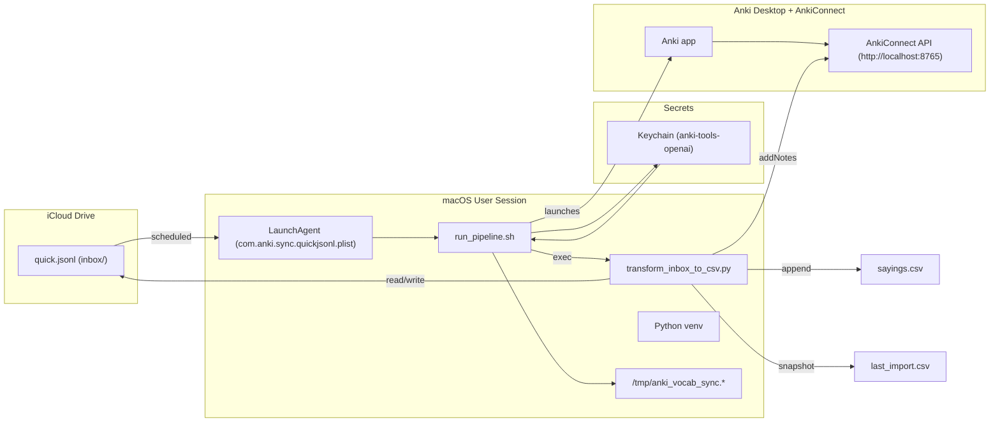

# 🇵🇹 Anki Portuguese Automation — Unified README
*Updated: 2025-10-24*

End-to-end workflow to capture and automate Portuguese vocabulary from iPhone, iPad, or MacBook into Anki using GPT and AnkiConnect.  
Enrich it to **C1-level European Portuguese**, and **load into Anki** via **AnkiConnect**.  
This README keeps your preferred unified structure and wording while aligning with the current codebase.

---

## 🧭 What this does (in 30 seconds)
- You add short words/phrases during the day (Notes, Shortcuts, etc.).
- They’re appended to a single **iCloud JSONL inbox**:
  ```
  ~/Library/Mobile Documents/com~apple~CloudDocs/Portuguese/Anki/inbox/quick.jsonl
  ```
- The transformer normalizes each item and asks GPT for **pt-PT** translations and **C1** example sentences (≈12–22 words).
- Notes are added to Anki (deck **Portuguese (pt-PT)**, your note type), and CSV snapshots are kept:
  - `~/Library/Mobile Documents/com~apple~CloudDocs/Portuguese/Anki/sayings.csv`
  - `~/Library/Mobile Documents/com~apple~CloudDocs/Portuguese/Anki/last_import.csv`

---

## 🧱 Architecture



**Key design choices**
- Security first: API key stored only in macOS Keychain and injected at runtime; env overrides (`OPENAI_BASE_URL`, etc.) are cleared.
- Idempotent ingestion: The script normalizes and de-duplicates before generating or posting to Anki.
- Append-only master CSV: `sayings.csv` is the canonical export; `last_import.csv` makes the latest batch easy to review or re-import.
- Observable by default: Plain-text logs in `/tmp` simplify debugging; a manual kickstart exists for one-off runs.

1. **Capture**: You append JSONL lines to `quick.jsonl` from iPhone/iPad/Mac.
2. **Inbox**: All raw inputs live in `.../Anki/inbox/quick.jsonl`.
3. **Transform** (`transform_inbox_to_csv.py`):
   - Normalizes an English lemma or a PT headword.
   - Calls GPT for **pt-PT** translation + **C1 sentence**.
   - Appends one row per item to `sayings.csv` and writes `last_import.csv` snapshot.
   - Pushes the new notes into Anki via **AnkiConnect** (localhost:8765).
4. **Review**: You study cards in Anki with spaced repetition.

> The goal is **idempotent**, low-friction ingestion that keeps your Anki deck authoritative.


---

## 🧾 Anki Card Data Contract (Note Model & Field Order)

**Note type (model):** GPT Vocabulary Automater  
**Default deck:** Portuguese (pt-PT)  
**CSV source:** `sayings.csv` (UTF-8, comma-separated, quoted as needed)

**Field order (must match exactly)**
| Field           | Type   | Description                                       |
|-----------------|--------|---------------------------------------------------|
| `word_pt`       | text   | Portuguese headword/phrase (front).               |
| `word_en`       | text   | English lemma/gloss (back helper).                |
| `sentence_pt`   | text   | C1-level pt-PT example sentence (≈12–22 words).   |
| `notes`         | text   | Optional hints, POS, synonyms.                    |
| `image`         | media  | Optional image reference.                         |

The CSV columns are written in this exact order by the transformer and are inserted into Anki in the same order. If your note type uses a different field order, update the model to match or map fields accordingly before importing.

**Format & constraints**
- Encoding: UTF-8 only (the pipeline enforces UTF-8).  
- Punctuation/quotes: CSV is properly quoted; do not hand-edit quotes.  
- Length: keep `word_*` fields short; `sentence_pt` targets C1 length and style.  
- Duplicates: the pipeline de-duplicates against `sayings.csv` and within a batch.  
- In Anki, set the model’s duplicate check to the first field (`word_en`) and scope to “Deck” (recommended).  
- No media fields: images are handled statically in your Anki template (pipeline does not fetch images).  
- Audio: generated at review time with Anki TTS using `sentence_pt` (see template snippet below).

---

## 📁 Paths & files

Portuguese/
└─ Anki/
   ├─ inbox/
   │  ├─ quick.jsonl                  # daily inbox (cleared after first successful run each day)
   │  └─ .rotated-YYYY-MM-DD          # rotation stamp created on first successful run of the day
   ├─ sayings.csv                      # cumulative log of all inserted items
   ├─ last_import.csv                  # last batch snapshot
   └─ logs/                            # optional: if you tee script output here


---

Why TTS: This uses the platform’s pt-PT voice (e.g., Joana on macOS/iOS) to generate audio on-the-fly, keeping the collection small and guaranteeing that every `sentence_pt` is spoken. If you prefer pre-rendered files instead, generate audio during packaging and add a media field—but this project defaults to TTS for simplicity and portability.


---

## ⚙️ Requirements
- **macOS** (tested on Apple Silicon).
- **Anki** + **AnkiConnect** add-on (default port 8765).
- **Python 3.10+** in a virtualenv for the transformer script.
- **OpenAI API key** stored in **macOS Keychain** under service name `anki-tools-openai`.

---

## 🚀 Setup

### 1) Python environment
```bash
cd ~/anki-tools
python3 -m venv .venv
source .venv/bin/activate
pip install --upgrade pip
# pip install -r requirements.txt    # if your repo has one
```

### 2) OpenAI key in Keychain
```bash
# Store the key (replace ... with your real key)
security add-generic-password -a "$USER" -s "anki-tools-openai" -w "sk-..."
# Quick check:
security find-generic-password -a "$USER" -s "anki-tools-openai" -w | sed 's/\(.......\).*/.../'
```

### 3) Anki + AnkiConnect
- Install **AnkiConnect** add-on.
- Ensure Anki is running; AnkiConnect listens on `http://127.0.0.1:8765`.
- Create or confirm your note type (e.g., **GPT Vocabulary Automater**).

**Exact fields used by this repo’s scripts (align your note type to match):**
- **`word_pt`** — front: Portuguese headword/phrase. *(Enable **Duplicate Check** on this field if desired.)*
- **`word_en`** — back helper: English lemma/gloss.
- **`sentence_pt`** — C1-level example sentence in pt-PT (≈12–22 words).
- **`notes`** — optional helper notes / POS / hints.
- **`image`** — optional media reference (filename or ``).

> If your note type currently uses other names, either rename them in Anki or update the field mapping in `transform_inbox_to_csv.py` to these exact keys.

---

## ▶️ Run it once
```bash
bash ~/anki-tools/run_pipeline.sh
```
You should see console logs like “Will process N item(s)” and “Anki addNotes added X/N”.

---

## ⏱️ Schedule (LaunchAgent)
Recommended times: 09:00, 14:00, 20:00. Ensure the Mac is awake/logged in for runs.  
(Your LaunchAgent plist can call `bash ~/anki-tools/run_pipeline.sh`.)

---

## 🔒 Key behavior: C1 enrichment
The transformer prompts GPT to return **pt-PT** translation and a **C1-level** example sentence (≈12–22 words), aligned with your learning goal. This yields richer context and better recall.

You can monitor token usage at **OpenAI Usage**: https://platform.openai.com/usage

---

## ✅ New: Daily inbox rotation (simple mode)
To keep the pipeline idempotent and avoid re-adding items, the inbox file  
`Portuguese/Anki/inbox/quick.jsonl` is **cleared once per day** after the **first successful run**.

**Why**
- Prevents duplicates from lingering in `quick.jsonl`.
- Works cleanly with multiple LaunchAgent runs per day.
- Only clears when the Python step succeeds, so you never lose unprocessed items on failure.

### What changed in `run_pipeline.sh`
1) **Added paths + a daily rotate stamp** (after launching Anki and `sleep 3`):
```bash
# ---- Paths for the inbox + daily rotation marker ----
ANKI_BASE="$HOME/Library/Mobile Documents/com~apple~CloudDocs/Portuguese/Anki"
INBOX="$ANKI_BASE/inbox"
QUICK="$INBOX/quick.jsonl"
TODAY="$(date +%F)"
ROTATE_STAMP="$INBOX/.rotated-$TODAY"
mkdir -p "$INBOX"

# remove old stamps (keep only today's) — POSIX-safe for macOS
for f in "$INBOX"/.rotated-*; do
  [ -e "$f" ] || continue
  [ "$(basename "$f")" = ".rotated-$TODAY" ] && continue
  rm -f "$f"
done
```

2) **Stopped using `exec`** so post-run steps can execute; we now capture the Python exit code:
```bash
# ---- Run transformer (capture exit code instead of exec) ----
set +e
"$HOME/anki-tools/.venv/bin/python" -u "$HOME/anki-tools/transform_inbox_to_csv.py"   --deck "Portuguese (pt-PT)" --model "GPT Vocabulary Automater"
STATUS=$?
set -e
```

3) **Daily clear on first successful run** (truncates the file; logged once per day):
```bash
# ---- Daily delete on first successful run ----
if [[ $STATUS -eq 0 && ! -f "$ROTATE_STAMP" ]]; then
  echo "[rotate] status=$STATUS stamp=$ROTATE_STAMP quick=$QUICK"   # optional log line
  : > "$QUICK"                                                      # truncate; keeps path valid
  touch "$ROTATE_STAMP"
  echo "[rotate] quick.jsonl cleared for $TODAY"
fi
```

> Prefer **hard delete**? Replace `: > "$QUICK"` with: `rm -f "$QUICK"`

### Verify quickly
```bash
# Add a dummy line
echo '{"ts":"2025-10-24 12:00:00","entries":"dummy"}' >> "$HOME/Library/Mobile Documents/com~apple~CloudDocs/Portuguese/Anki/inbox/quick.jsonl"

# Run once — should CLEAR and stamp
bash ~/anki-tools/run_pipeline.sh
ls -la "$HOME/Library/Mobile Documents/com~apple~CloudDocs/Portuguese/Anki/inbox"/.rotated-*
wc -c "$HOME/Library/Mobile Documents/com~apple~CloudDocs/Portuguese/Anki/inbox/quick.jsonl"  # → 0 bytes

# Run again — should NOT clear (stamp exists)
bash ~/anki-tools/run_pipeline.sh
```

---

## 🧪 Quick checks
- **Anki open?** Anki must be running so AnkiConnect can accept requests.
- **Port free?** Nothing else should occupy 8765.
- **Key present?** `security find-generic-password -a "$USER" -s "anki-tools-openai" -w` shows your key.
- **Inbox has lines?** `wc -l .../inbox/quick.jsonl` > 0 for the first daily run.

---

## 🐞 Troubleshooting
- **“No entries to process”**: inbox is empty (either not captured yet or already cleared today).
- **Anki addNotes added 0/N**: check note type + field names, or duplicate check settings.
- **Connection refused**: open Anki; confirm AnkiConnect is enabled.
- **Unexpected duplicates**: with duplicate check on `word_pt`, ensure the front text is truly identical. Homographs (e.g., *assassino* noun vs adj.) can be disambiguated with POS tags or parentheses.

---

## 📊 Monitor usage
You can inspect token usage and costs at **OpenAI → Usage**:  
https://platform.openai.com/usage

---

## 🧾 Change log
- **2025-10-24** — Confirmed exact Anki note-type field names (`word_pt`, `word_en`, `sentence_pt`, `notes`, `image`). Added **Daily inbox rotation**; capture exit code in `run_pipeline.sh` (no `exec`); POSIX-safe cleanup of rotation stamps.
- **2025-10-23** — Unified README wording; emphasized C1 pt-PT enrichment; clarified iCloud paths; verified AnkiConnect flow; expanded troubleshooting.
- **2025-10-22** — Added OpenAI usage note and data contract section; clarified LaunchAgent schedule.

---

Happy studying! 🇵🇹🧠
