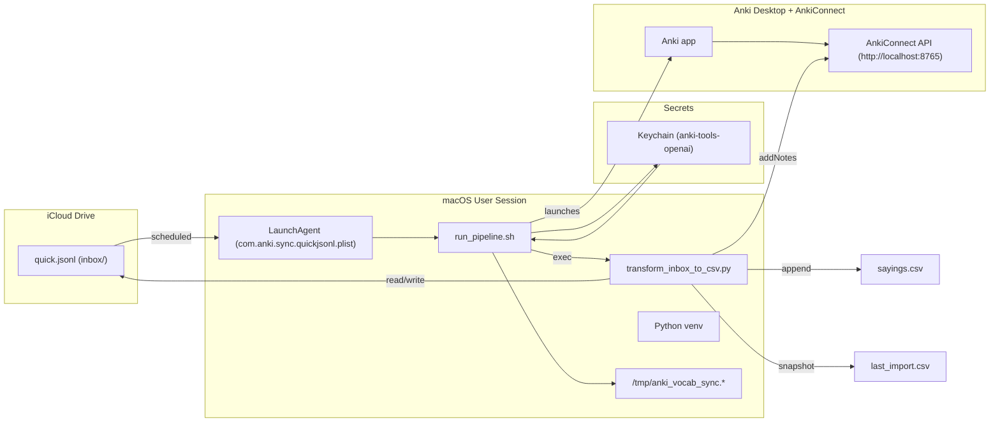

# 🇵🇹 Anki Portuguese Automation (pt-PT)

End-to-end, zero-click pipeline to capture vocabulary anywhere, enrich it with context using GPT, and auto-add cards to Anki via AnkiConnect.  
Built for European Portuguese (pt-PT) with daily scheduled runs on macOS.

> **Why Anki?**  
> This project leans on Anki’s spaced-repetition system (SRS) to build a durable, searchable knowledge base.  
> Your cards live in a local database and are repeatedly reviewed on an optimal schedule for retention.

---

## TL;DR

- Drop words/phrases into `iCloud/Portuguese/Anki/inbox/quick.jsonl` (use your “Save to Anki Inbox” shortcut).
- A macOS LaunchAgent runs at 09:00, 13:00, 19:00 (local), opens Anki, loads your OpenAI key from Keychain, and executes the Python pipeline in your venv.
- The pipeline:
  1) normalizes + de-dupes,
  2) asks the LLM for pt-PT translations + example sentences,
  3) appends rows to `sayings.csv`,
  4) writes a `last_import.csv` snapshot,
  5) adds cards to Anki (deck: Portuguese (pt-PT), model: GPT Vocabulary Automater).
- Logs: `/tmp/anki_vocab_sync.log` and `/tmp/anki_vocab_sync.err`.

---

## Architecture



**Key design choices**
- Security first: API key stored only in macOS Keychain and injected at runtime; env overrides (`OPENAI_BASE_URL`, etc.) are cleared.
- Idempotent ingestion: The script normalizes and de-duplicates before generating or posting to Anki.
- Append-only master CSV: `sayings.csv` is the canonical export; `last_import.csv` makes the latest batch easy to review or re-import.
- Observable by default: Plain-text logs in `/tmp` simplify debugging; a manual kickstart exists for one-off runs.

---

## Data Contracts

### Input — `quick.jsonl` (one object per line)
```json
{"ts":"2025-10-22 17:10:00","src":"quick","entries":"shoelace, radiator, meadow"}
```
- `ts`: string timestamp (local)
- `src`: freeform source label
- `entries`: comma-separated list of words/phrases

### Output — CSV schema (deck model: *GPT Vocabulary Automater*)
Columns:
- `word_en`
- `word_pt` (pt-PT)
- `sentence_pt` (pt-PT, natural usage)
- `sentence_en`
- `date_added` (`YYYY-MM-DD`)

## Card Images / Icons (New)

We now attach a visual to every note (Wikimedia thumbnail when available, emoji fallback otherwise).  
- One‑time: add `Image` and `ImageCredit` fields to the *GPT Vocabulary Automater* note type.  
- Update card templates and styling (see **docs/card-images.md**).  
- The pipeline uploads images to Anki via AnkiConnect (`storeMediaFile`), so visuals sync and work offline.

**Docs:** see https://github.com/ksimons29/anki-portuguese-sayings/blob/main/docs-card-images.md

**Commit hint**
```
docs(readme): add “Card images/icons” docs + templates + CSS
feat: image helpers (Wikimedia + emoji fallback) with AnkiConnect storeMediaFile
```

---

## Repository & File Overview

```
~/anki-tools/
├─ transform_inbox_to_csv.py        # Core pipeline: normalize, de-dupe, LLM, CSV, AnkiConnect
├─ run_pipeline.sh                  # Wrapper: reads Keychain, opens Anki, launches venv python
├─ merge_inbox.sh (optional)        # If present, merges fragments -> inbox/quick.jsonl
└─ .venv/                           # Virtual environment used for all runs
```

```
~/Library/Mobile Documents/com~apple~CloudDocs/Portuguese/Anki/
├─ inbox/quick.jsonl                # Input dropbox in iCloud
├─ sayings.csv                      # Canonical, append-only master CSV
└─ last_import.csv                  # Snapshot of the most recent batch
```

```
~/Library/LaunchAgents/
└─ com.anki.sync.quickjsonl.plist   # LaunchAgent with schedule + logs
```

```
/tmp/
├─ anki_vocab_sync.log              # Stdout
└─ anki_vocab_sync.err              # Stderr
```

---

## Prerequisites

- macOS with Anki Desktop and **AnkiConnect** add-on enabled
- Python venv at `~/anki-tools/.venv/`
- `openai` Python SDK installed **in that venv**
- iCloud Drive enabled

---

## Setup (one-time)

1) Create/activate venv and install deps
```bash
cd ~/anki-tools
python3 -m venv .venv
./.venv/bin/pip install --upgrade pip openai
```

2) Store your OpenAI key in Keychain (no secrets in files)
```bash
# Write (hidden prompt)
security add-generic-password -a "$USER" -s anki-tools-openai -w -U

# Read (avoid printing during normal runs)
security find-generic-password -s anki-tools-openai -w
```

3) Configure the wrapper
- `~/anki-tools/run_pipeline.sh` will:
  - export `OPENAI_API_KEY` from Keychain
  - unset `OPENAI_BASE_URL`, `OPENAI_API_BASE`, `OPENAI_ORG_ID`, `OPENAI_PROJECT`
  - open Anki and wait briefly for AnkiConnect
  - execute the Python pipeline via `~/.venv/bin/python` with unbuffered output

4) Install the LaunchAgent
- File: `~/Library/LaunchAgents/com.anki.sync.quickjsonl.plist`
- Key settings:
  - `RunAtLoad = true`
  - `KeepAlive = false`
  - `StartCalendarInterval` at **09:00, 13:00, 19:00**
  - `StandardOutPath = /tmp/anki_vocab_sync.log`
  - `StandardErrorPath = /tmp/anki_vocab_sync.err`
```bash
launchctl unload ~/Library/LaunchAgents/com.anki.sync.quickjsonl.plist 2>/dev/null || true
launchctl load  ~/Library/LaunchAgents/com.anki.sync.quickjsonl.plist
```

5) Create your inbox
```bash
INBOX="$HOME/Library/Mobile Documents/com~apple~CloudDocs/Portuguese/Anki/inbox"
mkdir -p "$INBOX"
```

---

## Quick Verify

```bash
# Ensure AnkiConnect is reachable
open -gj -a "Anki" || true; sleep 3
curl -s localhost:8765 -X POST -H 'Content-Type: application/json' -d '{"action":"version","version":6}'
```

```bash
# Seed a test input line
cat >> "$INBOX/quick.jsonl" <<'JSONL'
{"ts":"2025-10-22 13:20:00","src":"quick","entries":"herbs, deodorant, wrestling, sky"}
JSONL
```

```bash
# Manual run (same entrypoint the scheduler uses)
launchctl kickstart -k gui/$(id -u)/com.anki.sync.quickjsonl
```

Watch logs live:
```bash
tail -f /tmp/anki_vocab_sync.log /tmp/anki_vocab_sync.err
```

Expected: new rows appended to `sayings.csv`, recent rows in `last_import.csv`, and new notes in Anki (duplicates skipped).

---

## Security Model

- Key storage: macOS Keychain item `anki-tools-openai`
- Runtime injection: wrapper exports `OPENAI_API_KEY` only for the process lifetime
- No secret logging: command tracing disabled; logs never print secrets
- Clean base URL: env overrides are unset to ensure the official endpoint is used
- Key rotation: re-run the `add-generic-password` command to overwrite; then test with a manual kickstart

If you ever pasted a key at the shell by mistake (shows as “command not found”):
- Re-add to Keychain with the hidden method above
- Optionally clear shell history for that session

---

## Scheduling & Power

- Runs at 09:00, 13:00, 19:00 (local)
- Mac must be logged in and awake
- Recommended: Amphetamine triggers around:
  - 08:55–09:10
  - 12:55–13:10
  - 18:55–19:10
- Display sleep is fine; don’t allow full system sleep during windows.
  Clamshell mode requires external power + display.

Optional: Add `WatchPaths` to the LaunchAgent to trigger immediately when `quick.jsonl` changes (in addition to the schedule).

---

## Customization

- Deck: `Portuguese (pt-PT)`
- Model: `GPT Vocabulary Automater`
- LLM prompting: tuned for pt-PT; consider adding hard preferences (e.g., “lagoon -> lagoa”) in `transform_inbox_to_csv.py`
- Dedup strategy: normalize case/whitespace and compare against both CSV and Anki to avoid re-adds

---

## Troubleshooting

- **Nothing happens at schedule**  
  Check LaunchAgent is loaded:
  ```bash
  launchctl list | grep com.anki.sync.quickjsonl || echo "not loaded"
  ```
- **AnkiConnect not responding**  
  Open Anki manually and confirm the add-on is enabled, then:
  ```bash
  curl -s localhost:8765 -X POST -H 'Content-Type: application/json' -d '{"action":"version","version":6}'
  ```
- **Logs are empty**  
  Ensure the `.plist` `StandardOutPath`/`StandardErrorPath` point to `/tmp` and the wrapper prints a header.
- **Duplicate cards still appear**  
  Confirm normalization rules and queries used for dedup (CSV + Anki search).
- **Key errors**  
  Re-add the Keychain item and verify `run_pipeline.sh` reads it at runtime.

Clear logs:
```bash
: > /tmp/anki_vocab_sync.log; : > /tmp/anki_vocab_sync.err
```

---

## Local Testing (without scheduler)

```bash
open -gj -a "Anki" || true; sleep 3
~/anki-tools/.venv/bin/python ~/anki-tools/transform_inbox_to_csv.py --deck "Portuguese (pt-PT)" --model "GPT Vocabulary Automater"
```

---

---

## Monitoring OpenAI API Usage

You can verify and monitor cost and token activity for this pipeline in the **OpenAI Usage Dashboard**:

1. Open: `https://platform.openai.com/usage/activity` (you must be **Organization Owner** to view).
2. Use the **date range** and **project** filters to drill into the exact period and project used by this automation.
3. Click into **API capabilities** (e.g., “Responses”) to see **per‑model** breakdowns and minute‑level TPM when needed.
4. Remember: all usage timestamps are shown in **UTC** in the dashboard.

> If your org still uses the legacy view, use `https://platform.openai.com/usage/legacy` (or `.../account/usage`) and switch between **Cost** and **Activity**. The legacy dashboard will be removed eventually.

**Optional exports**
- Use the Export button in the usage dashboard to download CSVs for longer-range analysis.

---

## C1 Sentence Generation (pt‑PT)

The transformer enforces **advanced European Portuguese** output for examples:

- **Register & locale:** idiomatic **pt‑PT** (European Portuguese).
- **Level:** **C1** complexity, native-like collocations.
- **Length:** **12–22 words** for `sentence_pt` (concise but rich).
- **Fields returned by the model (JSON only):** `word_en`, `word_pt`, `sentence_pt`, `sentence_en` (plain ASCII quotes, no code fences).
- **English gloss:** `sentence_en` is a natural translation, not literal word-by-word.

**Posting to Anki**
- Deck: **Portuguese (pt‑PT)**
- Model: **GPT Vocabulary Automater**
- Tags: `auto`, `pt-PT`, plus a run-specific tag
- Duplicates: `allowDuplicate = false`, `duplicateScope = deck` (duplicates are **skipped**, logged, and not re-added)

**Input hygiene & skips**
- Normalizes whitespace/case, trims trailing punctuation.
- Heuristics avoid obviously long sentences that already end with terminal punctuation to keep generation focused on words/phrases.
- If the entry matches an existing note (by deck lookup), it is treated as a duplicate.

---

## Changelog

### 2025-10-22
“Today’s Changes and File Guide”
- Stored real OpenAI key in Keychain (`anki-tools-openai`), rotated safely with hidden input.
- Verified the key by reading it back and making a live OpenAI call from the venv.
- Ensured the `openai` package is installed and all runs use that interpreter.
- Added `run_pipeline.sh` wrapper to export the key, clear `OPENAI_*` base variables, open Anki, wait for AnkiConnect, and run Python with unbuffered output.
- Added temporary debug prints then removed command tracing so the key is never echoed to logs.
- Replaced the LaunchAgent to call the wrapper and write logs to `/tmp/anki_vocab_sync.log` + `.err`.
- Fixed schedule at 09:00, 13:00, 19:00 with `RunAtLoad=true`, `KeepAlive=false`.
- Tested E2E: appended to `sayings.csv`, wrote `last_import.csv`, AnkiConnect added notes, duplicates skipped.
- Added Amphetamine trigger plan around run windows.
- Next: reinforce pt-PT lexical preferences; clearer “duplicate skipped” log lines; optional WatchPaths trigger.

---

## License

Private, personal automation. Adapt with care.
