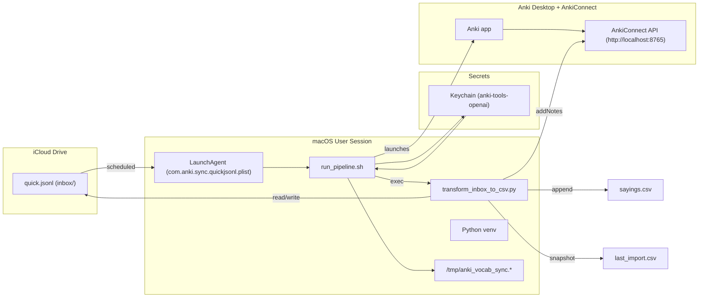

# 🇵🇹 Anki Portuguese Automation — Unified README
*Updated: 2025-10-23*

End-to-end workflow to capture and automate Portuguese vocabulary from iPhone, iPad, or MacBook into Anki using GPT and AnkiConnect.
Enrich it to **C1‑level European Portuguese**, and **load into Anki** via **AnkiConnect**.
This README keeps your preferred unified structure and wording while aligning with the
current codebase.

---

## 🧭 What this does (in 30 seconds)
- You **add** English or Portuguese words/short phrases from any device.
- They’re **appended** to a single **iCloud JSONL inbox**:
  ```
  /Users/koossimons/Library/Mobile Documents/com~apple~CloudDocs/Portuguese/Anki/inbox/quick.jsonl
  ```
- The transformer **normalizes, deduplicates, and enriches** items using GPT, producing **pt‑PT** translations
  with **C1** example sentences (≈12–22 words).
- Notes are inserted into Anki (Deck **Portuguese (pt‑PT)**, Model **GPT Vocabulary Automater**) via **AnkiConnect**.

> **Images:** the pipeline no longer fetches images. If you want visuals, add a **static image** to the Anki card template.


## 🧠 How It Works

1. You add English or Portuguese words on any Apple device (iPhone, iPad, MacBook).
2. These are saved into:
   ```
   ~/Library/CloudStorage/iCloud Drive/Portuguese/Anki/inbox/quick.jsonl
   ```
3. A macOS LaunchAgent runs a pipeline **automatically at 09:00 Lisbon time** each day.
4. The pipeline does the following:
   - Opens Anki (ensures AnkiConnect is available)
   - Runs `sanitize_quick_jsonl.py` to clean quotes and unicode
   - Calls GPT (OpenAI) using `transform_inbox_to_csv.py`
   - Generates the following:
     - `word_pt`, `word_en`, `sentence_pt`, `sentence_en`, `date_added`
   - Ensures no duplicates (checked against `sayings.csv`)
   - Adds new notes to Anki (deck: `Portuguese (pt‑PT)`, model: `GPT Vocabulary Automater`)
   - Moves processed file to `.done` archive
   - Logs success or failure

---

## 🧱 Architecture

## Architecture



**Key design choices**
- Security first: API key stored only in macOS Keychain and injected at runtime; env overrides (`OPENAI_BASE_URL`, etc.) are cleared.
- Idempotent ingestion: The script normalizes and de-duplicates before generating or posting to Anki.
- Append-only master CSV: `sayings.csv` is the canonical export; `last_import.csv` makes the latest batch easy to review or re-import.
- Observable by default: Plain-text logs in `/tmp` simplify debugging; a manual kickstart exists for one-off runs.

---

## 📂 Data contract (JSONL inbox)
Each line in `quick.jsonl` is a **valid JSON object**. Accepted shapes:
The transformer reads **one JSON object per line** from `inbox/quick.jsonl`.

**Required keys (choose one):**
- `entries` → either a **string** or a **list of strings**.  
  - When a **string**, it is **split** by the regex `[,
;]+` (commas, semicolons, or newlines).  
  - When a **list**, **each item** is split by the same regex.
- `word` → a single string (equivalent to a one‑item `entries` line).

**Optional keys (ignored by the transformer but safe to include):**
- `ts` (timestamp), `src` (source), or any other metadata.
### Examples (all valid)

```json
[
  {"ts":"2025-10-22 17:17:42","src":"quick","entries":"Suspected"},
  {"ts":"2025-10-22 22:23:35","src":"quick","entries":"Coding standards"},
  {"ts":"2025-10-22 22:23:42","src":"quick","entries":"Computer mouse"},
  {"ts":"2025-10-23 11:41:16","src":"quick","entries":"Euro bill"}
]
--
#### 🧾 Anki Card Data Contract (Note Model & Field Order)

