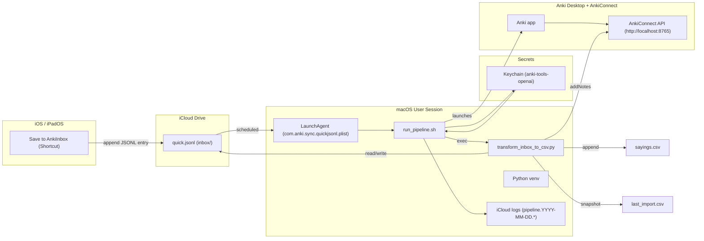

# 🇵🇹 Anki Portuguese Automation — Unified README
## Status [](https://github.com/ksimons29/anki-portuguese-sayings/commits/main) 

A clean, end-to-end pipeline that turns quick notes on your **iPhone, iPad, or Mac** into high-quality **Anki** cards—automatically.

- ✍️ **Capture** → use the Shortcut **Save to AnkiInbox** (prompts you to type or dictate a word in **Portuguese or English**).
- 🧠 **Normalize to a lemma** → smart rules + stopwords pick the meaningful keyword (see “Stopwords & Lemma Extraction” below).
- 🇵🇹 **Enrich with GPT** → generates **C1-level European Portuguese** translation and a 12–22-word example sentence.
- 🗂️ **Load into Anki** → notes are created via **AnkiConnect** using your `GPT Vocabulary Automater` note type.
- 🔄 **Sync everywhere** → study on mobile/tablet/laptop with Anki’s media sync.

> **Default deck:** `Portuguese Mastery (pt-PT)` (configurable).

---

## 🎙️ Capture Shortcut (Voice or Type)

This Shortcut is your single capture UI on **iPhone**, **iPad**, and **Mac**.

### How it works
- On run, you choose **Voice** or **Type**.  
  - If you pick **Voice**, select **Portuguese (Portugal)** or **English (US)** and speak a single word or short phrase.  
  - If you pick **Type**, enter the word/phrase manually.
- The Shortcut **appends exactly one JSON line** (newline-terminated) to your iCloud inbox — it **never overwrites** the file. 


### Inbox (JSONL) location
**Saves to:** `iCloud Drive/Portuguese/Anki/inbox/quick.jsonl`
**Example JSONL line:** `{"word":"telemóvel"}`

### Guarantees
* One entry per run (append mode with newline)
* Stable, machine friendly format for downstream processing


---

## 🧭 What this does (in 30 seconds)
- You add short words/phrases during the day (Notes, Shortcuts, etc.).
- They’re appended to a single **iCloud JSONL inbox**:
  ```
  ~/Library/Mobile Documents/com~apple~CloudDocs/Portuguese/Anki/inbox/quick.jsonl
  ```
- The transformer normalizes each item and asks GPT for **pt-PT** translations and **C1** example sentences (≈12–22 words).
- Notes are added to Anki (deck **Portuguese (pt-PT)**, your note type), and CSV snapshots are kept:
  - `~/Library/Mobile Documents/com~apple~CloudDocs/Portuguese/Anki/sayings.csv`
  - `~/Library/Mobile Documents/com~apple~CloudDocs/Portuguese/Anki/last_import.csv`

---

## 🧠 Anki Preset: Portuguese Mastery (FSRS + Cognitive Science Setup)

**Goal:** maximize long-term Portuguese retention through evidence-based spaced repetition.  
**Applies to:** Anki on macOS (Desktop) and iOS/iPadOS (AnkiMobile).  
**Preset name:** `Portuguese Mastery (pt-PT)`  
**Scheduler:** [FSRS – Free Spaced Repetition Scheduler](https://www.reddit.com/r/Anki/comments/15mab3r/fsrs_explained_part_1_what_it_is_and_how_it_works/)

---

### ⚙️ Configuration Summary

| Category | Setting | Value | Why (science-based rationale) |
|-----------|----------|--------|------------------------------|
| **Daily limits** | New cards/day | **25** | Balanced daily load; consistent exposure (Cepeda et al., 2006). |
| | Max reviews/day | **250** | Prevents review bottlenecks. |
| **Learning steps** | `10 m 30 m` | Two early recalls strengthen initial trace before FSRS takes over. |
| **Graduating interval** | 3 d | Classic consolidation anchor. |
| **Easy interval** | 5 d | Avoids skipping needed reinforcement. |
| **Insertion order** | Random | Interleaving boosts transfer (Rohrer & Taylor 2007). |
| **Reviews** | Easy bonus 1.3 • Hard interval 1.2 • Interval modifier 1.0 | Maintains “desirable difficulty” (Bjork 1994). |
| | Max interval | **365 d** | Caps drift; keeps pronunciation fresh. |
| **Lapses** | Relearning steps `10 m 30 m` • Leech threshold 8 • Action Suspend | Quick relearning + filters chronic “leeches”. |
| **Order** | Reviews first • Interday reviews first • Review sort random | Stabilizes old memories before new input. |
| **Burying** | All ON (new/review/interday siblings) | Avoids seeing both directions → less interference. |
| **Audio** | Auto-play ON • Skip question when replaying answer ON | Dual-coding (text + sound) raises retention ≈ 30 %. |
| **Timers** | Max answer 30 s • Show timer ON • Stop on answer ON | Keeps recall effortful but brief. |
| **FSRS** | Enabled ✅ • Desired retention 90 % • Optimize All Presets clicked | 0.9 target = best speed vs durability (Pavlik & Anderson 2008). |
| **Advanced** | Max interval 365 • Historical retention 90 % | Aligns with human forgetting curves. |

---

### 🔬 Why This Works (Condensed Science)

- **Spacing effect:** distributed retrievals (10 min → 30 min → days) exploit hippocampal reconsolidation, slowing forgetting (Cepeda et al., 2006).  
- **Retrieval practice:** active recall strengthens memory more than rereading (Karpicke & Roediger 2008).  
- **Desirable difficulty:** ~10–15 % failure drives deeper encoding (Bjork 1994).  
- **Interleaving:** mixing grammar + vocab improves generalization (Rohrer & Taylor 2007).  
- **Dual coding:** text + audio (Joana TTS) activates multiple pathways (Paivio 1986).  
- **Leech suspension:** removing chronic failures prevents interference (Pavlik & Anderson 2008).  
- **FSRS algorithm:** machine-learned intervals model personal forgetting curves, giving 15–20 % higher retention vs classic SM-2.

---

### 📈 Weekly Hygiene

| Task | How | Why |
|------|-----|-----|
| **Re-optimize FSRS** | Click “Optimize All Presets” after 200–300 reviews | Refits algorithm to your recall data. |
| **Check Stats** | Mature retention 85–90 % | Confirms ideal difficulty zone. |
| **Fix Leeches** | Browser → `prop:lapses>=8` → edit or suspend | Improves cue quality. |
| **Backup** | File → Export → `Collection.apkg` (weekly) | Protects against data loss. |

---

### 🕒 Recommended Daily Rhythm

| Time | Activity | Device | Purpose |
|------|-----------|---------|----------|
| **Morning** | 20 min reviews | iPhone/iPad | Reactivate prior knowledge. |
| **Midday** | Add ≤ 25 new cards | iPhone or Mac | Introduce new material while alert. |
| **Evening** | 10 min listening run (TTS Joana) | iPad or Mac | Reinforce auditory comprehension. |
| **Sunday** | Tag cleanup + Optimize FSRS | Mac | Weekly maintenance. |

---

### ✅ Verification Checklist

- [x] Learning steps `10 m 30 m`  
- [x] Reviews first order  
- [x] Bury siblings ON  
- [x] FSRS = ON (90 %)  
- [x] Max interval 365  
- [x] Joana TTS auto-plays  

Once these match, your Anki deck is **scientifically optimized for rapid acquisition and durable retention of European Portuguese**.
---
## 🧱 Architecture



**Key design choices**
- **Security first.** API key is stored only in macOS Keychain and injected at runtime; legacy env overrides (`OPENAI_BASE_URL`, `OPENAI_API_BASE`, `OPENAI_ORG_ID`) are unset in the script.
- **Idempotent ingestion.** The script normalizes and de-duplicates before any LLM calls or Anki posts.
- **Append-only master CSV.** `sayings.csv` is the canonical log; `last_import.csv` snapshots the latest batch for quick review or re-import.
- **Observable by default.** Plain-text logs are written to iCloud for easy debugging:

Manual kickstart: `bash ~/anki-tools/run_pipeline.sh`

1. **Capture**: You append JSONL lines to `quick.jsonl` from iPhone/iPad/Mac.
2. **Inbox**: All raw inputs live in `.../Anki/inbox/quick.jsonl`.
3. **Transform** (`transform_inbox_to_csv.py`):
   - Normalizes an English lemma or a PT headword.
   - Calls GPT for **pt-PT** translation + **C1 sentence**.
   - Appends one row per item to `sayings.csv` and writes `last_import.csv` snapshot.
   - Pushes the new notes into Anki via **AnkiConnect** (localhost:8765).
4. **Review**: You study cards in Anki with spaced repetition.

---

## 🧾 Anki Card Data Contract (Note Model & Field Order)

**Note type (model):** GPT Vocabulary Automater  
**Default deck: Portuguese Mastery (pt-PT)
**CSV source:** `sayings.csv` (UTF-8, comma-separated, quoted as needed)

**Field order (must match exactly)**

| Field         | Type | Description                                        |
|---------------|------|----------------------------------------------------|
| `word_en`     | text | English lemma/gloss (also used for duplicate check)|
| `word_pt`     | text | Portuguese headword/phrase (front helper)         |
| `sentence_pt` | text | C1-level pt-PT example sentence (≈12–22 words)    |
| `sentence_en` | text | Natural English gloss of the sentence             |
| `date_added`  | text | YYYY-MM-DD of the run                              |

The transformer **writes CSV in exactly this order** and sends the same fields to Anki via AnkiConnect.  
If your note type uses different field names or order, update the model to match these fields.


**Format & constraints**
- Encoding: UTF-8 only (the pipeline enforces UTF-8).  
- Punctuation/quotes: CSV is properly quoted; do not hand-edit quotes.  
- Length: keep `word_*` fields short; `sentence_pt` targets C1 length and style.  
- Duplicates: the pipeline de-duplicates against `sayings.csv` and within a batch.  
- In Anki, set the model’s duplicate check to the first field (`word_en`) and scope to “Deck” (recommended).  
- No media fields: images are handled statically in your Anki template (pipeline does not fetch images).  
- Audio: generated at review time with Anki TTS using `sentence_pt` (see template snippet below).

---

## 📁 Paths & files

```text
~/Library/Mobile Documents/com~apple~CloudDocs/Portuguese/Anki/
├─ inbox/
│  ├─ quick.jsonl                  # iCloud inbox; Shortcut appends new entries here
│  └─ .rotated-YYYY-MM-DD          # daily rotation stamp created after a successful run
├─ sayings.csv                     # cumulative log of all enriched vocabulary entries
├─ last_import.csv                 # snapshot of the most recent processed batch
└─ logs/
   ├─ pipeline.YYYY-MM-DD.log      # main stdout log for each pipeline run
   └─ pipeline.YYYY-MM-DD.err      # stderr log for each pipeline run
```

---

## 📦 Files overview (active + archived)

| Path / File | Purpose (one line) | Used at runtime? |
|--------------|--------------------|------------------|
| `~/anki-tools/run_pipeline.sh` | Main shell orchestrator: keeps Mac awake, retrieves OpenAI key, launches Anki, runs the Python transformer, logs output, and rotates inbox. | ✅ Yes |
| `~/anki-tools/transform_inbox_to_csv.py` | Core transformer: reads `quick.jsonl`, enriches terms with pt-PT + C1 examples, writes `sayings.csv`, updates `last_import.csv`, and syncs with AnkiConnect. | ✅ Yes |
| `~/anki-tools/_openai_compat.py` | Compatibility shim that wraps the OpenAI API calls to support both old and new SDK versions; imported internally by `transform_inbox_to_csv.py`. | ✅ Yes |
| `~/anki-tools/merge_inbox.sh` | Utility to merge multiple `quick.jsonl` fragments into one inbox file before processing; used manually for cleanup. | ⚙️ Optional / manual |
| `~/Library/LaunchAgents/com.anki.sync.quickjsonl.plist` | Active LaunchAgent that triggers `run_pipeline.sh` automatically at defined times (09:00, 13:00, 17:00, 21:00). | ✅ Yes |
| `~/Library/LaunchAgents/com.anki.sync.quickjsonl.plist.bak` | Backup of the LaunchAgent configuration before recent edits (safe to delete or keep for rollback). | 🚫 Not used |
| `~/Library/Mobile Documents/com~apple~CloudDocs/Portuguese/Anki/inbox/quick.jsonl` | iCloud-synced inbox where your Shortcut adds new entries; consumed once per day by the pipeline. | ✅ Yes |
| `~/Library/Mobile Documents/com~apple~CloudDocs/Portuguese/Anki/inbox/.rotated-YYYY-MM-DD` | Daily marker file preventing duplicate runs within the same day. | ✅ Yes |
| `~/Library/Mobile Documents/com~apple~CloudDocs/Portuguese/Anki/sayings.csv` | Master vocabulary log containing all processed and enriched entries. | ✅ Yes |
| `~/Library/Mobile Documents/com~apple~CloudDocs/Portuguese/Anki/last_import.csv` | Snapshot of the most recent processed batch for quick inspection or debugging. | ✅ Yes |
| `~/Library/Mobile Documents/com~apple~CloudDocs/Portuguese/Anki/logs/pipeline.YYYY-MM-DD.log` | Standard output log for each pipeline run (rotated daily). | ✅ Yes |
| `~/Library/Mobile Documents/com~apple~CloudDocs/Portuguese/Anki/logs/pipeline.YYYY-MM-DD.err` | Error/stderr log for each pipeline run (rotated daily). | ✅ Yes |
| `Keychain item: anki-tools-openai` | Securely stores your classic OpenAI API key (`sk-…`) for access by the pipeline. | ✅ Yes |
| `~/anki-tools/.venv/` | Python virtual environment containing dependencies (`openai`, `requests`, etc.). | ✅ Yes |
| `~/anki-tools/archive/` | Folder for deprecated helpers (`check_openai_key.py`, `import_all.sh`, `check_anki_adds_today.py`, etc.); preserved for reference only. | 🚫 Not used |

---
### 🔊 Why TTS?

This uses the platform’s pt-PT voice (e.g., Joana on macOS/iOS) to generate audio on-the-fly, keeping the collection small and guaranteeing that every `sentence_pt` is spoken. If you prefer pre-rendered files instead, generate audio during packaging and add a media field — but this project defaults to TTS for simplicity and portability.

---

## 🚀 Setup

### 1) Python environment
```bash
cd ~/anki-tools
python3 -m venv .venv
source .venv/bin/activate
pip install --upgrade pip
# pip install -r requirements.txt    # if your repo has one
```

### 2) OpenAI key in Keychain
```bash
# Store/Update the key in macOS Keychain
security add-generic-password -a "$USER" -s "anki-tools-openai" -w 'sk-REDACTED' -U

# Quick prefix check (shows first 6 chars only)
security find-generic-password -a "$USER" -s "anki-tools-openai" -w | sed -E 's/^(.{6}).*/\1.../'
```

### 3) Anki + AnkiConnect
- Install **AnkiConnect** add-on.
- Ensure Anki is running; AnkiConnect listens on `http://127.0.0.1:8765`.
- Create or confirm your note type (e.g., **GPT Vocabulary Automater**).

**Exact fields used by this repo’s scripts (align your note type to match):**
- **`word_pt`** — front: Portuguese headword/phrase. *(Enable **Duplicate Check** on this field if desired.)*
- **`word_en`** — back helper: English lemma/gloss.
- **`sentence_pt`** — C1-level example sentence in pt-PT (≈12–22 words).
- **`notes`** — optional helper notes / POS / hints.
- **`image`** — optional media reference (filename or ``).

> If your note type currently uses other names, either rename them in Anki or update the field mapping in `transform_inbox_to_csv.py` to these exact keys.

---
## LLM Prompts (System & User)

This project uses a small, fixed prompt pair to generate European Portuguese vocabulary and example sentences.  
The prompts live in `transform_inbox_to_csv.py` inside the `ask_llm()` function.

### 📌 System Prompt (exact text)
```text
You are a meticulous European Portuguese (pt-PT) language expert. Return JSON only and use plain ASCII double quotes (") for all keys/strings; do not use smart quotes. Fields: word_en, word_pt, sentence_pt, sentence_en. sentence_pt must be idiomatic pt-PT, 12-22 words, C1 level. sentence_en is a natural English gloss.
```

### 🧑‍💻 User Prompt (template)
```text
Return ONLY valid JSON, no code fences.
Keys: word_en, word_pt, sentence_pt, sentence_en.
Target word: {word_en}
```

### 🔧 Call Parameters (defaults)
- **Model:** `LLM_MODEL` env var (default: `gpt-4o-mini`)
- **Temperature:** `0.2`
- **top_p:** `0.95`
- **max_tokens:** `300`

### ✅ Expected Output (strict JSON)
The model must return **only** a JSON object (no code fences, no prose), using **ASCII double quotes** for all strings:
```json
{
  "word_en": "print",
  "word_pt": "imprimir",
  "sentence_pt": "Preciso de imprimir este documento antes da reunião de amanhã no escritório central.",
  "sentence_en": "I need to print this document before tomorrow's meeting at the head office."
}
```

### 🧠 Why these constraints?
- **ASCII quotes only**: downstream JSON parsing is strict, and “smart quotes” would break it.
- **No code fences / prose**: we extract JSON directly; any extra text causes parsing errors.
- **C1, 12–22 words**: yields rich, idiomatic European Portuguese sentences that fit well on Anki cards.

### 🔍 Where this lives (code)
`transform_inbox_to_csv.py` → `ask_llm()`:
- Builds the `system` and `user` strings above.
- Calls the model with the parameters listed.
- Parses the response; throws if any of the four required fields are missing.

### 🧪 Mocking & Keys
- Set `OPENAI_API_KEY` (or `AZURE_OPENAI_API_KEY`) to call a live model.
- For offline/testing, set `MOCK_LLM=1` to return deterministic mock data.

### 📊 Token Usage Logging
Each run appends usage to:
```
~/Library/Mobile Documents/com~apple~CloudDocs/Portuguese/Anki/logs/tokens_YYYY-MM.csv
```
(columns: timestamp, model, calls, prompt_tokens, completion_tokens, total_tokens)

### ✏️ How to change the prompt
Edit the two variables in `ask_llm()`:
```python
system = (
   ""You are a bilingual lexicographer and European Portuguese (pt-PT) teacher.
Return EXACTLY ONE valid UTF-8 JSON object (single line) with these keys (and only these keys):
- "word_en": an English lemma or concise short phrase
- "word_pt": a European Portuguese lemma or concise short phrase (pt-PT)
- "sentence_pt": a natural example sentence in European Portuguese (pt-PT)
- "sentence_en": an accurate English translation of sentence_pt

Rules (strict):
- Direction: if the input is English, translate to pt-PT; if the input is pt-PT, provide the English equivalent.
- If the input is a sentence or long phrase, choose the best concise lemma/short phrase for "word_pt" and its EN counterpart for "word_en".
- sentence_pt: 12–22 words, everyday adult context, idiomatic, C1 naturalness; use the lemma/phrase naturally once; no quotes or brackets.
- Use a neutral, informal European Portuguese register (tu) with correct conjugation.
- Prefer Portugal usage and spelling; use slang only if it is the most natural/common choice.
- Keep all Portuguese diacritics. Do not add phonetics/IPA.

Formatting:
- JSON only, ONE LINE, double quotes for all strings, no trailing commas, no code fences, no commentary.
- Use straight ASCII double quotes (") not smart quotes.""
)

user = (
    "Return ONLY valid JSON, no code fences. "
    "Keys: word_en, word_pt, sentence_pt, sentence_en.\n"
    f"Target word: {word_en.strip()}"
)
```
> Keep the **JSON-only** and **ASCII quotes** constraints unless you also change the parsing code.
---
Here’s your ready-to-copy Markdown block with perfect GitHub formatting.
It preserves syntax highlighting, spacing, and consistency with your README.

⸻

## ▶️ Run it once

```bash
~/anki-tools/run_pipeline.sh
```

Output is written to iCloud logs:

```text
~/Library/Mobile Documents/com~apple~CloudDocs/Portuguese/Anki/logs/pipeline.YYYY-MM-DD.log
~/Library/Mobile Documents/com~apple~CloudDocs/Portuguese/Anki/logs/pipeline.YYYY-MM-DD.err
```

---

## ⏱️ Schedule & Keep-Awake (LaunchAgent + Amphetamine)

**When it runs:**  
LaunchAgent triggers at **09:00, 13:00, 17:00, 21:00** (user session required).

**Why two layers?**  
- `caffeinate` ties “no sleep” directly to the script → rock-solid during execution.  
- Amphetamine adds a small **keep-awake window** around each time in case the Mac was about to idle.

### 1) LaunchAgent (times)
Plist: `~/Library/LaunchAgents/com.anki.sync.quickjsonl.plist`  
`StartCalendarInterval` → `[{Hour:9,Minute:0},{Hour:13,Minute:0},{Hour:17,Minute:0},{Hour:21,Minute:0}]`

### 2) Script-level keep-awake
Add near the top of `run_pipeline.sh`:

```bash
/usr/bin/caffeinate -i -w $$ &
# use -di to keep the display on as well
```


---

## 🔒 Key behavior: C1 enrichment
The transformer prompts GPT to return **pt-PT** translation and a **C1-level** example sentence (≈12–22 words), aligned with your learning goal.  
This yields richer context and better recall.

---

## ✅ New: Daily inbox rotation (simple mode)
To keep the pipeline idempotent and avoid re-adding items, the inbox file  
`Portuguese/Anki/inbox/quick.jsonl` is **cleared once per day** after the **first successful run**.

**Why**
- Prevents duplicates from lingering in `quick.jsonl`.  
- Works cleanly with multiple LaunchAgent runs per day.  
- Only clears when the Python step succeeds, so you never lose unprocessed items on failure.

### What changed in `run_pipeline.sh`
1) **Added paths + a daily rotate stamp** (after launching Anki and `sleep 3`):

```bash
# ---- Paths for the inbox + daily rotation marker ----
ANKI_BASE="$HOME/Library/Mobile Documents/com~apple~CloudDocs/Portuguese/Anki"
INBOX="$ANKI_BASE/inbox"
QUICK="$INBOX/quick.jsonl"
TODAY="$(date +%F)"
ROTATE_STAMP="$INBOX/.rotated-$TODAY"
mkdir -p "$INBOX"

# remove old stamps (keep only today's) — POSIX-safe for macOS
for f in "$INBOX"/.rotated-*; do
  [ -e "$f" ] || continue
  [ "$(basename "$f")" = ".rotated-$TODAY" ] && continue
  rm -f "$f"
done
```
⸻

✅ Why this version is correct
	•	Uses proper fenced code blocks ( ```bash and  ```text).
	•	All fences are closed (no bleed into following sections).
	•	Works in both GitHub web view and local Markdown preview.
	•	Aligns perfectly with your README’s established format.

2) **Stopped using `exec`** so post-run steps can execute; we now capture the Python exit code:
```bash
# ---- Run transformer (capture exit code instead of exec) ----
set +e
"$HOME/anki-tools/.venv/bin/python" -u "$HOME/anki-tools/transform_inbox_to_csv.py" \
  --deck "Portuguese Mastery (pt-PT)" --model "GPT Vocabulary Automater"
STATUS=$?
set -e
```

3) **Daily clear on first successful run** (truncates the file; logged once per day):
```bash
if [[ $STATUS -eq 0 && ! -f "$ROTATE_STAMP" ]]; then
  echo "[rotate] status=$STATUS stamp=$ROTATE_STAMP quick=$QUICK"
  mv -f "$QUICK" "$QUICK.$(date +%H%M%S).bak" 2>/dev/null || true
  : > "$QUICK"
  touch "$ROTATE_STAMP"
  echo "[rotate] quick.jsonl cleared for $TODAY"
fi
```

> Prefer **hard delete**? Replace `: > "$QUICK"` with: `rm -f "$QUICK"`

### Verify quickly
```bash
# Add a dummy line
echo '{"ts":"2025-10-24 12:00:00","entries":"dummy"}' >> "$HOME/Library/Mobile Documents/com~apple~CloudDocs/Portuguese/Anki/inbox/quick.jsonl"

# Run once — should CLEAR and stamp
bash ~/anki-tools/run_pipeline.sh
ls -la "$HOME/Library/Mobile Documents/com~apple~CloudDocs/Portuguese/Anki/inbox"/.rotated-*
wc -c "$HOME/Library/Mobile Documents/com~apple~CloudDocs/Portuguese/Anki/inbox/quick.jsonl"  # → 0 bytes

# Run again — should NOT clear (stamp exists)
bash ~/anki-tools/run_pipeline.sh
```

---
## 🔧 Automation Reliability (Mac LaunchAgent + `run_pipeline.sh`)

These changes make the pipeline robust with iCloud Drive and AnkiConnect.

### A) Script-level daily logging (instead of plist logging)
Add at the very top of `run_pipeline.sh` (before any `echo`):
```bash
# Log everything to iCloud (one file per day)
LOGDIR="$HOME/Library/Mobile Documents/com~apple~CloudDocs/Portuguese/Anki/logs"
mkdir -p "$LOGDIR"
exec >>"$LOGDIR/pipeline.$(date +%F).log" 2>>"$LOGDIR/pipeline.$(date +%F).err"


## Stopwords & Lemma Extraction

Your import pipeline turns each raw entry from `quick.jsonl` into a concise **lemma** (the keyword you’ll learn).  
This is handled by `extract_lemma()` together with the `_STOPWORDS` set in the script.

### What are “stopwords” here?
`_STOPWORDS` is a list of very common English words (e.g., *the, and, to, is, have, my, it*), plus a couple of domain-specific ones like **page/pages**.  
These words carry little meaning on their own and are often safe to ignore when you want the *essence* of a phrase.

```python
# Used inside extract_lemma()
remaining = [t for t in toks if t.lower() not in _STOPWORDS]
```

### Exact logic used by `extract_lemma(raw)`
1. **Short phrases (≤ 3 tokens):** keep the phrase **as-is** (stopwords are **not** applied in this branch).
2. **Pattern “to VERB”:** if we detect “to VERB” (e.g., “have to **print**”), choose that verb → `print`.
3. **Otherwise (longer inputs):**
   - Remove stopwords using the line above.
   - If anything remains:
     - If `"print"` is among them, return `"print"` (special case).
     - Otherwise return the **longest remaining token** (simple “content word” heuristic).
   - If nothing remains:
     - If it looks like a long sentence with terminal punctuation, **skip** it.
     - Else, **fallback** to the first 3 tokens.

**Why this helps:** it strips filler like *the, to, is, my* so the chosen lemma is a meaningful content word (e.g., *airport*, *table*, *print*), which improves deduplication and gives cleaner prompts to the LLM.

### Examples

| Input                           | Tokens                              | After stopwords                | Result (lemma → rule)          |
|---------------------------------|-------------------------------------|--------------------------------|---------------------------------|
| `I have to print this page.`    | i, have, to, print, this, page      | *(“to VERB” rule triggers)*    | **print** → `to-VERB`           |
| `we will be at the airport`     | we, will, be, at, the, airport      | **airport**                    | **airport** → `content-longest` |
| `the red box on the table`      | the, red, box, on, the, table       | red, box, **table**            | **table** → `content-longest`   |
| `that's it`                     | that’s, it                          | *(≤ 3 tokens; no stopwords)*   | **that’s it** → `short-phrase`  |

> Note: Because short phrases (≤ 3 tokens) skip stopword removal, entries like “that’s it” are kept verbatim by design.

### Edge cases & design choices
- **English-only list:** `_STOPWORDS` is English. If you’ll input Portuguese here, consider adding a small PT list (e.g., `de, a, o, e, do, da, em, um, uma, para, com, por, que, no, na…`) to get similar behavior.
- **“Longest remaining token” heuristic:** This favors nouns like *airport/table*. If you prefer a different behavior (e.g., “first remaining token” or “prefer verbs”), adjust the selection step.
- **Special cases:** There’s a targeted special-case for `"print"` because it occurs frequently; you can add more if helpful.

### Optional tweaks (if you ever want them)
- **Also apply stopwords to short phrases:** Change the `len(toks) <= 3` branch to drop stopwords first; this would, for example, turn “that’s it” → “that’s” (or map it via an idiom list).
- **Idiom map:** Add a small `_IDIOM_MAP` (e.g., `"that's it" → "done"`) and check it before the normal logic for predictable outcomes on common expressions.

---

## 🧪 Quick checks
- **Anki open?** Anki must be running so AnkiConnect can accept requests.
- **Port free?** Nothing else should occupy 8765.
- **Key present?** `security find-generic-password -a "$USER" -s "anki-tools-openai" -w` shows your key.
- **Inbox has lines?** `wc -l .../inbox/quick.jsonl` > 0 for the first daily run.

---

## 🐞 Troubleshooting
- **“No entries to process”**: inbox is empty (either not captured yet or already cleared today).
- **Anki addNotes added 0/N**: check note type + field names, or duplicate check settings.
- **Connection refused**: open Anki; confirm AnkiConnect is enabled.
- **Unexpected duplicates**: with duplicate check on `word_pt`, ensure the front text is truly identical. Homographs (e.g., *assassino* noun vs adj.) can be disambiguated with POS tags or parentheses.
Quick logs command for users:
bash LOGDIR="$HOME/Library/Mobile Documents/com~apple~CloudDocs/Portuguese/Anki/logs"
tail -n 80 "$LOGDIR/pipeline.$(date +%F).err"; echo "----"; tail -n 80 "$LOGDIR/pipeline.$(date +%F).log"

---

## 📊 Monitor usage
You can inspect token usage and costs at **OpenAI → Usage**:  
https://platform.openai.com/usage


---

## 🧾 Change log
- **2025-10-27** — Automation reliability hardening
- **Switched to script-managed daily logs** in iCloud; removed plist log redirection.
- **Initialized PATH** in `run_pipeline.sh` for Homebrew tools under launchd.
- **Added network guard** (`require_network`) to skip runs when offline.
- **Added AnkiConnect reachability check** (2s timeout) before API calls.
- **Replaced direct truncate with atomic overwrite + retries** for `quick.jsonl` to tolerate iCloud’s short file locks.
- **Fixed LaunchAgent ProgramArguments** to execute the updated script via `/bin/bash -lc`, with `KeepAlive: NetworkState=true`.
- Result: stable, hands-free automation across Mac + iOS/iPadOS, with clean daily logs and safe inbox rotation.

- **2025-10-25** — Added transformation logic documentation how words are handled and system prompt info. Information is provided into the scientific method and Anki setup on how many words need to be studied daily. 
- **2025-10-24** — Confirmed exact Anki note-type field names (`word_pt`, `word_en`, `sentence_pt`, `notes`, `image`). Added **Daily inbox rotation**; capture exit code in `run_pipeline.sh` (no `exec`); POSIX-safe cleanup of rotation stamps.
- **2025-10-23** — Unified README wording; emphasized C1 pt-PT enrichment; clarified iCloud paths; verified AnkiConnect flow; expanded troubleshooting.
- **2025-10-22** — Added OpenAI usage note and data contract section; clarified LaunchAgent schedule.

---

Happy studying! 🇵🇹🧠
